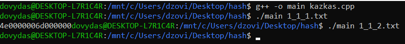
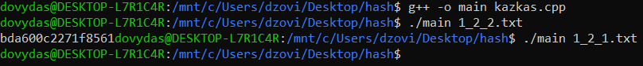
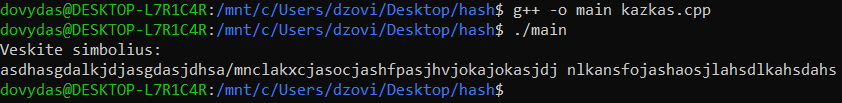
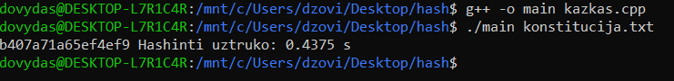
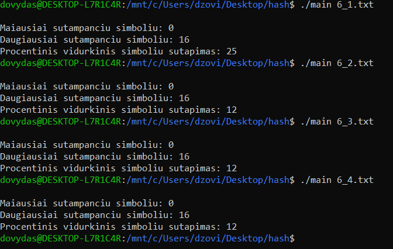

# Hash-Generatorius

Ši programa yra hash generatorius, įvedus failo pavadinimą automatiškai sudaromas hashas. Yra galimybė neįrašius jokio failo, duomenis suvesti ranka

## Pseudo kodas

start  
skaitomas failas  
sudaromas pirmasis hashas  
hashas sudaromas keliant tam tikru laipsniu  
pakeičiama į hexą  
sudaromas antrasis hashas  
sudedami hashai  
atliekami patikrinimai jei reikalingi  
spausdinamas Hashas  
end  

## Analizė

Šiame punkte reikėjo išbandyti kaip skiriasi hashas jei failai skirsis vienu simboliu, kiek matome iš paskutinės nuotraukos, hashai yra visiškai skirtingi.

Čia paimtas yra normalus konstitucijos tekstas ir skaičiuojama per kiek laiko viskas yra suhashinima

Kaip matome porų, kurios būtų visiškai identiškos nėra

Čia buvo apskaičiuota kiek mažiausiai/daugiausia pasikartojimų randama, ir vidutinis procentas kiek vienodų simbolių būna

## Išvados

Stipriosios pusės:

  Šis hash generatorius nesudaro dvejų visiškai vienodų porų, kai skiriasi tik 1 ženklu. Gan mažas procentas kurie simboliai supranta apie 16%. Veikia palyginus greitai
  
 Silpnosios pusės:
 
 Pasitaiko kai visi simboliai sutampa(labai retai). Kai simbolių rinkinys yra labai mažas(1-2 simboliai) hashas tampa labai paprastas turi didelę galimybę sutapti.
  
