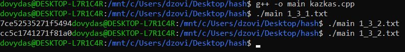

# Hash-Generatorius

Ši programa yra hash generatorius, įvedus failo pavadinimą automatiškai sudaromas hashas. Yra galimybė neįrašius jokio failo, duomenis suvesti ranka

## Pseudo kodas

start  
skaitomas failas  
sudaromas pirmasis hashas  
hashas sudaromas keliant tam tikru laipsniu  
pakeičiama į hexą  
sudaromas antrasis hashas  
sudedami hashai  
atliekami patikrinimai jei reikalingi  
spausdinamas Hashas  
end  

## Analizė

